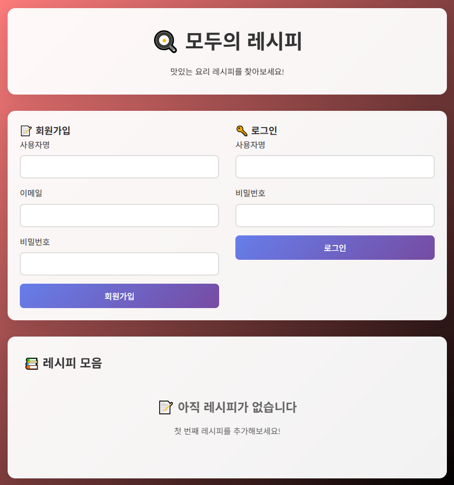
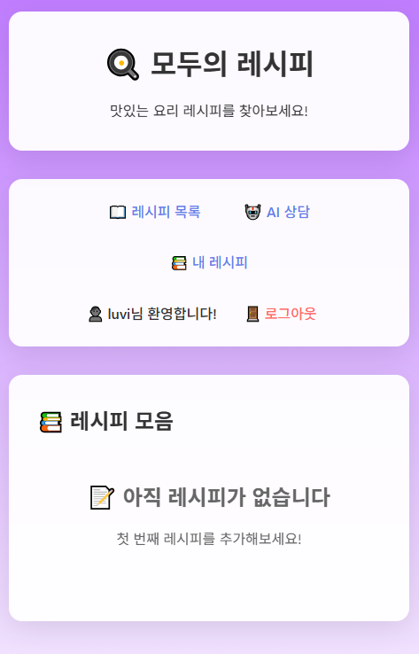
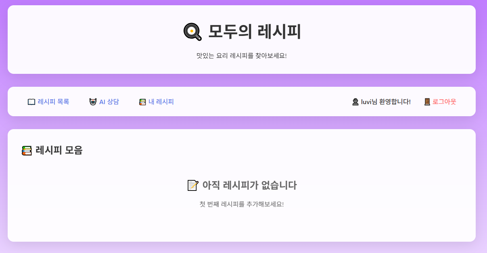
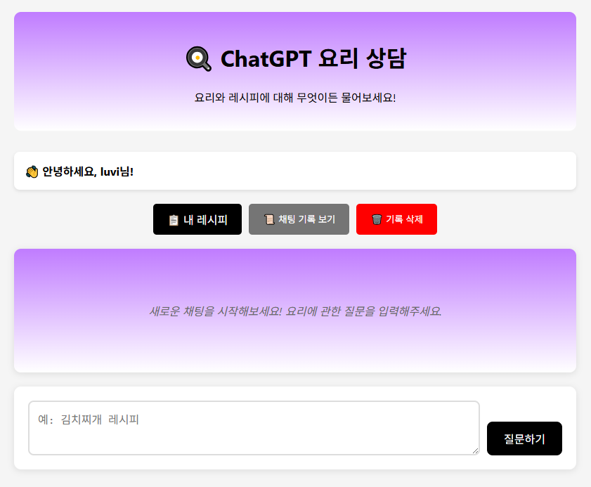

# 🍳 나만의 레시피 (FastAPI & ChatGPT)

ChatGPT API를 활용하여 레시피를 추천받고, 나만의 레시피를 관리할 수 있는 웹 애플리케이션입니다.

---

## 🚀 프로젝트 소개

FastAPI와 Jinja2 템플릿을 이용해 구현한 **레시피 관리 및 AI 채팅 웹 앱**입니다.

- OpenAI ChatGPT API를 연동하여 사용자 질문에 맞는 요리 레시피를 실시간 추천
- 세션 기반 인증으로 로그인된 사용자만 레시피 생성 및 AI 채팅 이용 가능
- HTML, CSS, JavaScript 기반의 사용자 친화적 UI

---

## 🛠️ 기술 스택

| 구분     | 기술                                |
|--------|-------------------------------------|
| Backend | FastAPI, Uvicorn, Pydantic, Python, Jinja2 |
| Frontend | HTML, CSS, JavaScript               |
| API     | OpenAI ChatGPT                      |
| Auth    | 세션 기반 인증 (쿠키)                  |

---

## 📁 프로젝트 구조

📦 PROJECT_FIRST/
┣ 📂 static/
┃ ┗ 📜 chat.js
┣ 📂 templates/
┃ ┣ 📜 chat.html
┃ ┣ 📜 my_recipes.html
┃ ┣ 📜 recipe_detail.html
┃ ┗ 📜 recipe.html
┣ 📂 wireframe/
┃ ┣ 📜 after_login_app.png
┃ ┣ 📜 after_login.png
┃ ┣ 📜 AI_chat.png
┃ ┗ 📜 makeuser_login.png
┣ 📜 .gitignore
┣ 📜 authpy
┣ 📜 chatgpt_service.py
┣ 📜 models.py
┣ 📜 README.md
┣ 📜 recipe.py
┗ 📜 requirements.txt

---

## ⚙️ 실행 방법

1. 필요한 라이브러리를 설치합니다:

```(venv)
pip install fastapi uvicorn jinja2 pydantic openai python-jose bcrypt
```

2. FastAPI 서버 실행:

```(venv)
uvicorn recipe:app --reload
```

3. 웹 브라우저에서 접속:

API 서버 (Swagger UI): http://127.0.0.1:8000/docs

메인 페이지: http://127.0.0.1:8000/recipes

---

## WBS (Work Breakdown Structure)
```
gantt
    title 레시피 프로젝트 개발 일정
    dateFormat  YYYY-MM-DD
    axisFormat  %m/%d

    section 프로젝트 계획
    요구사항 분석 및 API 확인     :done, planning, 2025-06-10, 2h
    프로젝트 구조 설계           :done, design, 2025-06-10, 1h

    section 백엔드 개발 (FastAPI)
    개발환경 설정               :backend-setup, 2025-06-10, 1h
    API 연동 모듈 개발          :backend-api, after backend-setup, 3h
    레시피 검색 엔드포인트      :backend-search, 2025-06-11, 2h
    레시피 상세 엔드포인트      :backend-detail, after backend-search, 2h
    CORS 설정 및 테스트         :backend-test, after backend-detail, 1h

    section 프론트엔드 개발
    HTML 구조 설계              :frontend-html, 2025-06-10, 2h
    CSS 스타일링               :frontend-css, 2025-06-11, 3h
    JavaScript 기능 구현        :frontend-js, 2025-06-11, 4h
    API 연동 및 데이터 처리     :frontend-api, after frontend-js, 3h

    section 통합 및 테스트
    프론트-백엔드 연동         :integration, 2025-06-12, 2h
    기능 테스트 및 버그 수정    :testing, after integration, 3h
    UI/UX 개선                 :ui-improve, after testing, 2h

    section 배포 및 마무리
    배포 준비                  :deploy-prep, 2025-06-12, 1h
    문서화 및 README 작성      :documentation, after deploy-prep, 1h
    최종 점검 및 제출          :final-check, after documentation, 1h
```
---

## 🔑 핵심 기능
### ✅ 사용자 관리
- 회원가입 / 로그인 / 로그아웃

- 세션 기반 인증으로 로그인 상태 유지

### 🍲 레시피 CRUD
- 레시피 생성, 조회, 수정, 삭제

- 자신이 작성한 레시피만 수정 및 삭제 가능

- '내 레시피' 페이지에서 개인 레시피만 모아보기

### 🤖 AI 레시피 상담 (ChatGPT 연동)
- 로그인된 사용자만 AI 채팅 기능 사용 가능

- 요리 관련 질문 시 ChatGPT가 실시간으로 답변 및 레시피 추천

- AI가 추천한 레시피를 저장 가능 ('내 레시피'에 추가)

### 💬 채팅 기록 관리
- 사용자별 질문/답변 기록 확인 가능

- 채팅 기록 전체 삭제 기능

---

## 📸 와이어프레임



---



---



---



---

## 📌 포트폴리오 목적
- Backend API 개발 역량 강조
- Full-Stack 기능 구현 및 통합 능력 강조
- AI 서비스 연동 및 활용 능력 강조

---

## 🙋 기여자
- Hyeoni-729